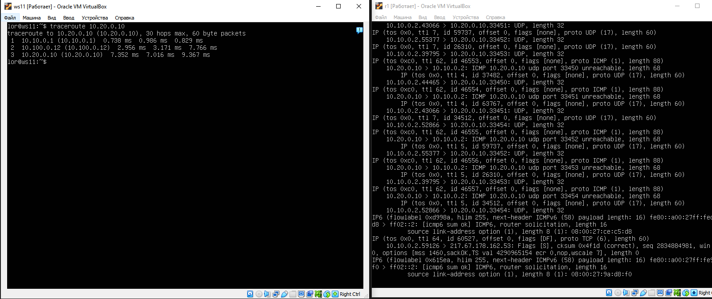
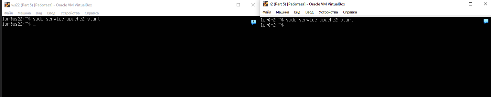

# Сети в Linux

## Part 1. Инструмент **ipcalc**  
В данном проекте используется следующая машина:  
  
*Версия Ubuntu*  

Итак, приступим к выполнению задания! Дедлайн горит, отчисление маячит.

### 1.1. Сети и маски  

1) **Адрес сети 192.167.38.54/13**  

Адрес сети найдем при помощи утилиты `ipcalc`  

  
`ipcalc 192.167.38.54/13`  

Адрес сети находится под пунктом **Network** и равен 192.160.0.0/13  

2) **Перевод маски 255.255.255.0 в префиксную и двоичную запись, /15 в обычную и двоичную, 11111111.11111111.11111111.11110000 в обычную и префиксную**  

При помощи той же утилиты `ipcalc` определим префиксную и двоичную запись маски 255.255.255.0:  

  
`ipcalc 255.255.255.0`  

Результат выполнения находится под пунктом **Netmask** - префиксная запись маски равна /24, а двоичная 11111111.11111111.11111111.00000000  

Далее тем же способом переведем префиксную запись маски /15 в обычную и двоичную:

  
`ipcalc 0.0.0.0/15`  

Результат выполнения находится все в том же пункте **Netmask**: обычная запись равна 255.254.0.0, а двоичная 11111111.11111110.00000000.00000000

Остался лишь перевод из двоичного вида в обычный и префиксный, но его осуществим при помощи головы, так как `ipcalc` не поддерживает бинарную запись масок:  11111111 в десятичной записи это 255, а 11110000 - 240. Следовательно, маска в десятичной записи выглядит, как 255.255.255.240, а в префиксной /28. Подтвердим наши расчеты при помощи команды `ipcalc 255.255.255.240/28`  

  
`ipcalc 255.255.255.240/28`  

Результат выполнения находится все в том же пункте **Netmask**: убедимся, что двоичная запись равна данной в задании - 11111111.11111111.11111111.11110000, а следовательно, расчеты верны.

3) **Минимальный и максимальный хост в сети 12.167.38.4 при масках: /8, 11111111.11111111.00000000.00000000, 255.255.254.0 и /4**

Минимальный и максимальный хост определяется точно так же при помощи утилиты `ipcalc`. Найдем хосты для следующей сети: 12.167.38.4/8  

  
`ipcalc 12.167.38.4/8`  

Минимальный и максимальный хосты располагаются под пунктом **HostMin** И **HostMax** соответственно. Для данного случая минимальный хост равен 12.0.0.1, а максимальный 12.255.255.254.  

Для маски 11111111.11111111.00000000.00000000 сначала необходимо осуществить перевод в префиксную запись, а именно /16. Вызовем команду:  

  
`ipcalc 12.167.38.4/16`  

Минимальный хост равен 12.167.0.1, а максимальный 12.167.255.254.  

Обычную запись маски можно использовать точно так же, как и префиксную: [address]/[mask]. Так и сделаем с маской 255.255.254.0:  

  
`ipcalc 12.167.38.4/255.255.254.0`  

Минимальный хост равен 12.167.38.1, а максимальный 12.167.39.254.  

Остается последняя маска /4, которая задается по аналогии с первой, а именно:  

  
`ipcalc 12.167.38.4/4`  

Минимальный хост равен 0.0.0.1, а максимальный 15.255.255.254.  

### 1.2. localhost  

Если приложение работает на localhost, то оно доступно только для запросов, поступающих на сетевой интерфейс, связанный с этим адресом. Поэтому можно обратиться к приложению только по адресу 127.0.0.1 или 127.0.0.0/8, которые являются алиасами для адреса localhost.

Соответственно, обращения к приложению с представленных IP-адресов будут неудачными.  

### 1.3. Диапазоны и сегменты сетей  

1) **Какие из перечисленных IP можно использовать в качестве публичного, а какие только в качестве частных: 10.0.0.45, 134.43.0.2, 192.168.4.2, 172.20.250.4, 172.0.2.1, 192.172.0.1, 172.68.0.2, 172.16.255.255, 10.10.10.10, 192.169.168.1?**

Частными адресами являются все, которые попадают в любой из следующих диапазонов:  

- 10.0.0.0/8 (то есть всё что начинается на 10.)
- 172.16.0.0/12 (то есть с 172.16.0.0 по 172.31.255.255 включительно)
- 192.168.0.0/16 (то есть со 192.168.0.0 по 192.168.255.255 включительно)

Частные адреса: 10.0.0.45, 192.168.4.2, 172.20.250.4, 10.10.10.10, 172.16.255.255.  
Публичные адреса: 134.43.0.2, 172.0.2.1, 192.172.0.1, 172.68.0.2, 192.169.168.1

2) **Какие из перечисленных IP адресов шлюза возможны у сети 10.10.0.0/18: 10.0.0.1, 10.10.0.2, 10.10.10.10, 10.10.100.1, 10.10.1.255?**  

При помощи утилиты `ipcalc` определим диапазон возможных адресов: 10.10.0.1 - 10.10.63.254. Следовательно, возможны следующие адреса: 10.10.0.2, 10.10.10.10, 10.10.1.255. 

  
`ipcalc 10.10.0.0/18`  

## Part 2. Статическая маршрутизация между двумя машинами

**С помощью команды** `ip a` **посмотреть существующие сетевые интерфейсы**  

Для того, чтобы посмотреть существующие сетевые интерфейсы, я воспользовался командой `ip a`  

  
`ip a` *на ws1*  

  
`ip a` *на ws2*  

Можно увидеть, что базово существует два интерфейса: **lo** и **enp0s3**, интерфейс **enp0s8** был подключен вручную в настройках самой программы VMBox.  

**Описать сетевой интерфейс, соответствующий внутренней сети, на обеих машинах и задать следующие адреса и маски: ws1 - 192.168.100.10, маска /16, ws2 - 172.24.116.8, маска /12**  

Сетевым интерфейсом, соответстующим внутренней сети, является интерфейс **enp0s8**, расположенный под номером 3. Объясню его вывод:  

- Интерфейс enp0s8 включен (state UP).
- MAC-адрес интерфейса - 08:00:27:cb:b0:2c на ws1 и 08:00:27:a2:af:b1 на ws2.

Для ручного измненения IP адреса на машине нам необходимо изменить конфигурационный файл *etc/netplan/00-installer-config.yaml*, а именно: добавить раздел **enp0s8**, в котором указать `dhcp4: no` и добавить строчку `addresses[]`, вписав в скобки новый адрес и маску. Результат изменений представлен ниже:  

  
*Конфигурационный файл на ws1*  

  
*Конфигурационный файл на ws2*  

**Выполнить команду** `netplan apply` **для перезапуска сервиса сети**

При вызове команды `netplan apply` без `sudo` появлялась следующая ошибка:  

  
*Ошибка*  

Но при использовании `sudo` команда ничего не выводит, что можно расценить, как успешное ее выполнение, дополнительно проверив успех путем перезагрузки машины и вызовом команды `ip a`  

  
*Результат* `sudo netplan apply`  

Так как мы внесли изменения в конфигурационный файл машины, они должны были сохраниться и примениться даже после перезагрузки, вот результат:  

  
`ip a` *после перезагрузки*  

Видим, что изменения сохранились, а значит, что все прошло успешно.  

### 2.1. Добавление статического маршрута вручную  

**Добавить статический маршрут от одной машины до другой и обратно при помощи команды вида** `ip r add`  

Добавление статического маршрута между машинами осуществляется при помощи команды вида `ip r add [address] dev enp0s8`, где указываeтся адрес машины-получателя.  

Результат проложенного статического маршрута представлен на рисунках ниже, все пингуется успешно.  

  
`Ping` *с ws1 на ws2*    

  
`Ping` *с ws2 на ws1*  

### 2.2. Добавление статического маршрута с сохранением  

**Добавить статический маршрут от одной машины до другой с помощью файла *etc/netplan/00-installer-config.yaml***  

Добавим статические маршруты в конфигурационные файлы следущюим образом и применим изменения при помощи команды `sudo netplan apply`  

  
*Конфигурационный файл ws1*   

  
*Конфигурационный файл ws2*  

Далее пропингуем машины друг между другом:

  
`Ping` *с ws1 на ws2*  

  
`Ping` *с ws2 на ws1*  

## Part 3. Утилита **iperf3**  

### 3.1. Скорость соединения  

**Перевести и записать в отчёт: 8 Mbps в MB/s, 100 MB/s в Kbps, 1 Gbps в Mbps**

- 8 Mbps = 1 MB/s
- 100 MB/s = 800 000 Kbps
- 1 Gbps = 1000 Mbps  

### 3.2. Утилита **iperf3**  

Для того, чтобы измерить скорость между машинами, одну из них нужно обозначить сервером командой `iperf3 -s`, а вторую машину обозначить клиентом и отправить запрос к ранее обозначенному серверу командой `iperf3 -c [ip адрес сервера]`   

  
*ws1 обозначена сервером*  

  
*ws2 обозначена клиентом*

Таким образом, скорость соединения между машинами составляет 1.13 Гбит/с.  

## Part 4. Сетевой экран  

### 4.1. Утилита **iptables**  

**Создать файл */etc/firewall.sh*, имитирующий фаерволл, на ws1 и ws2**  

Нужно добавить в файл подряд следующие правила:

1) на ws1 применить стратегию когда в начале пишется запрещающее правило, а в конце пишется разрешающее правило (это касается пунктов 4 и 5)

2) на ws2 применить стратегию когда в начале пишется разрешающее правило, а в конце пишется запрещающее правило (это касается пунктов 4 и 5)

3) открыть на машинах доступ для порта 22 (ssh) и порта 80 (http)

4) запретить `echo reply` (машина не должна "пинговаться”, т.е. должна быть блокировка на OUTPUT)

5) разрешить `echo reply` (машина должна "пинговаться")  

  
*firewall.sh на ws1*  

  
*firewall.sh на ws2*

> В первом файле */etc/firewall.sh* (для ws1) применяется стратегия, когда в начале пишется запрещающее правило, а в конце - разрешающее правило. Следовательно, весь входящий трафик проходит через список правил и проверяется на соответствие запрещающим правилам, а затем, если не соответствует ни одному запрещающему правилу, проверяется на соответствие разрешающим правилам. Таким образом, в данной стратегии доступ разрешается только в случае, если трафик удовлетворяет разрешающему правилу.
Во втором файле */etc/firewall.sh* (для ws2) применяется обратная стратегия, когда в начале пишется разрешающее правило, а в конце - запрещающее правило. То есть, входящий трафик сначала проверяется на соответствие разрешающему правилу, и если оно удовлетворяется, то доступ разрешается, а затем, если трафик не соответствует ни одному разрешающему правилу, проверяется на соответствие запрещающим правилам. Такая стратегия позволяет разрешать доступ по умолчанию и только блокировать трафик, который не соответствует ни одному разрешающему правилу.
Таким образом, разница между двумя стратегиями заключается в порядке применения разрешающих и запрещающих правил. В первом случае (ws1) - запрещающие правила в начале, разрешающие правила в конце, а во втором случае (ws2) - разрешающие правила в начале, запрещающие правила в конце. Это может привести к различному поведению фаерволла в отношении трафика и доступа к ресурсам.  

**Запустить файлы на обеих машинах командами** `chmod +x /etc/firewall.sh` **и** `/etc/firewall.sh` 

Запуск файлов на машинах:  

  
`chmod +x /etc/firewall.sh` *и* `/etc/firewall.sh` *на ws1*

  
`chmod +x /etc/firewall.sh` *и* `/etc/firewall.sh` *на ws2*

### 4.2. Утилита **nmap**

**Командой** `ping` **найти машину, которая не "пингуется", после чего утилитой nmap показать, что хост машины запущен**  

Проверка: в выводе **nmap** должно быть сказано: *Host is up*  

При помощи `ping` мы определяем, что ws1 не пингуется  

  
`ping 192.168.100.10`

  
`ping 172.24.116.8`  

Проверим, запущены ли хосты командой `nmap -Pn [address]`, где флаг `-Pn` обозначает отключение проверку пингом, так как у нас на одной из машин он отключен.  

  
`nmap -Pn [address]`  

## Part 5. Статическая маршрутизация сети  

Для выполнения данного задания было поднято 5 виртуальных машин: 3 рабочие станции и 2 роутера  

  

### 5.1. Настройка адресов машин  

- **Настроить конфигурации машин в *etc/netplan/00-installer-config.yaml* согласно сети на рисунке.**  

   

При настройке данной сети не пришлось прописывать статические маршруты, так как роутеры и машины находились в одних сетях, пришлось лишь указать адрес и маску машины для интерфейса **enp0s8/9** в конфигурационном файле.  

  
*Конифгурационный файл ws11*  

  
*Конифгурационный файл ws21*  

  
*Конифгурационный файл ws22*  

  
*Конифгурационный файл r1*  

  
*Конифгурационный файл r2*  

**Перезапустить сервис сети. Если ошибок нет, то командой** `ip -4 a` **проверить, что адрес машины задан верно. Также пропинговать ws22 с ws21. Аналогично пропинговать r1 с ws11.**  

  
`ping r1 + ip -4 a` *на ws11*  

  
`ping ws22 + ip -4 a` *на ws21*  

  
`ip -4 a` *на ws22*  

  
`ip -4 a` *на r1*  

  
`ip -4 a` *на r2*  

### 5.2. Включение переадресации IP-адресов.

**Для включения переадресации IP, выполните команду на роутерах:**  

`sysctl -w net.ipv4.ip_forward=1`  
При таком подходе переадресация не будет работать после перезагрузки системы.

  
`sysctl -w net.ipv4.ip_forward=1` *на r1*  

  
`sysctl -w net.ipv4.ip_forward=1` *на r2*  

**Откройте файл */etc/sysctl.conf* и добавьте в него следующую строку:**  

`net.ipv4.ip_forward = 1`  
При использовании этого подхода, IP-переадресация включена на постоянной основе.

  
*/etc/sysctl.conf на r1 и r2*  

### 5.3. Установка маршрута по-умолчанию  

**Настроить маршрут по-умолчанию (шлюз) для рабочих станций. Для этого добавить default перед IP роутера в файле конфигураций**  

  
*Default ws11*  

  
*Default ws21*  

  
*Default ws22*  

- **Вызвать** `ip r` **и показать, что добавился маршрут в таблицу маршрутизации**  

  
`ip r` *ws11*  

  
`ip r` *ws21*  

  
`ip r` *ws22*  

**Пропинговать с ws11 роутер r2 и показать на r2, что пинг доходит. Для этого использовать команду:**  

`tcpdump -tn -i eth1`

На r2 вызовем команду, указанную выше, только вместо *eth1* используем интерфейс, по которму связаны роутеры - *enp0s9*  
После вызова команды на r2 попробуем его пингануть с ws11:  

  
`tcpdump -tn -i enp0s9` *+* `ping 10.100.0.12`  

### 5.4. Добавление статических маршрутов  

- **Добавить в роутеры r1 и r2 статические маршруты в файле конфигураций.**  

  
*Cтатический маршрут с r1 в сеть 10.20.0.0/26*  

  
*Cтатический маршрут с r2 в сеть 10.10.0.0/18*  

- **Вызвать** `ip r` **и показать таблицы с маршрутами на обоих роутерах.**  

  
`ip r` *на r1*

  
`ip r` *на r2*  

Можно заметить, что каждый из роутеров теперь имеет доступ в соседнюю сеть при помощи другого роутера  

**Запустить команды на ws11:**   
`ip r list 10.10.0.0/[маска сети]` *и* `ip r list 0.0.0.0/0`  

  
`ip r list 10.10.0.0/18` *и* `ip r list 0.0.0.0/0`  

Адрес 0.0.0.0/0 обычно означает "любой адрес", следовательно команда `ip r list 0.0.0.0/0` выведет все маршруты, доступные на данном устройстве. Вывод команды `ip r list 10.10.0.0/18` будет отличаться, так как данный адрес и так находится в сети устройства, и для дальнейшей передачи пакета не требуется обращение к маршрутизатору.

### 5.5. Построение списка маршрутизаторов  

**Запустить на r1 команду дампа:**

`tcpdump -tnv -i eth0`

При помощи утилиты traceroute построить список маршрутизаторов на пути от ws11 до ws21

  
`tcpdump -tnv -i eth0` + `traceroute 10.20.0.10`  

Утилита **traceroute** начнет отправлять серию пакетов к удаленной машине с постепенным увеличением значения TTL (Time to Live) для каждого пакета. Каждый промежуточный маршрутизатор, через который проходят пакеты, будет записан в выводе команды **traceroute**. Вы увидите список IP-адресов или доменных имен маршрутизаторов, через которые проходят пакеты на пути к удаленной машине.  

### 5.6. Использование протокола **ICMP** при маршрутизации  

**Запустить на r1 перехват сетевого трафика, проходящего через eth0 с помощью команды:**  
`tcpdump -n -i eth0 icmp` - здесь, опять же, вместо eth0 будем использовать интерфейс, на котором завязана данная сеть - enp0s8

**Пропинговать с ws11 несуществующий IP (например, 10.30.0.111) с помощью команды:**  
`ping -c 1 10.30.0.111`  

  
`tcpdump -n -i enp0s8 icmp` + `ping -c 1 10.30.1.111`  

## Part 6. Динамическая настройка IP с помощью **DHCP**  

**Для r2 настроить в файле */etc/dhcp/dhcpd.conf* конфигурацию службы **DHCP**:**

1) Указать адрес маршрутизатора по-умолчанию, DNS-сервер и адрес внутренней сети.

  
*Конфигурация роутера в файле /etc/dhcp/dhcpd.conf*  

2) В файле *resolv.conf* прописать `nameserver 8.8.8.8`.  

  
*Файл resolv.conf*  

**Перезагрузить службу **DHCP** командой `systemctl restart isc-dhcp-server`. Машину ws21 перезагрузить при помощи `reboot` и через `ip a` показать, что она получила адрес. Также пропинговать ws22 с ws21.**  

  
`systemctl restart isc-dhcp-server` *+* `systemctl status isc-dhcp-server`

Для выполнения этого задания необходимо включить dhcp в конфигуарционных файлах на ws21, применить изменения, после чего перезагрузить машину и проверить результат. 

  
`ip a` *+* `ping` *на ws21*  

**Указать MAC адрес у ws11, для этого в *etc/netplan/00-installer-config.yaml* надо добавить строки:**  

`macaddress: 10:10:10:10:10:BA, dhcp4: true`  

  
*etc/netplan/00-installer-config.yaml на ws11*   

**Для r1 настроить аналогично r2, но сделать выдачу адресов с жесткой привязкой к MAC-адресу (ws11). Провести аналогичные тесты**

Для выполнения этого пункта так же, как и пунктом ранее, настроим два файла:  

  
*/etc/dhcp/dhcpd.conf на r1*   

  
*/etc/resolv.conf на r1*   

Далее перезагрузим dhcp и проверим его статус:  

  
`systemctl restart isc-dhcp-server` *+* `systemctl status isc-dhcp-server`  

Перезагрузим ws11 и проверим, получил ли он новый ip-адрес, а так же пинганем r1:  

  
`ip a` *+* `ping` *на ws11*  

**Запросить с ws21 обновление ip адреса**  

  
`ip a` *на ws21 до запроса*  

Далее делаем запрос `sudo dhclient` на получение ip адреса  

  
`ip a` *на ws21 после запроса*  

В данном пункте использовались такие опции dhcp сервера, как **dhclient** - для получения нового ip-адреса на машину, использовали динамическую выдачу ip-адресов на машины, что и является главной опцией dhcp-сервера, выдачу ip-адресов c привязкой по MAC-адресу, что не позволит хосту с таким же именем получить ip-адрес, предназначенный описанному в конфигурационном файле.

## Part 7. **NAT**

Для выполнения данного задания нам понадобятся машины из **Part 5**, откатим их при помощи дампов, сделанных по окончанию пятой части  

**В файле */etc/apache2/ports.conf* на ws22 и r1 изменить строку** `Listen 80` **на** `Listen 0.0.0.0:80` **, то есть сделать сервер Apache2 общедоступным**  

  
*/etc/apache2/ports.conf на ws22 и r1* 

**Запустить веб-сервер Apache командой** `service apache2 start` **на ws22 и r1**  

  
`service apache2 start` *на ws22 и r1*  

**Добавить в фаервол, созданный по аналогии с фаерволом из Части 4, на r2 следующие правила:**

1) удаление правил в таблице `filter - iptables -F`

2) удаление правил в таблице "NAT" - `iptables -F -t nat`

3) отбрасывать все маршрутизируемые пакеты - `iptables --policy FORWARD DROP`  

  
*firewall.sh на r2*  

Далее запустим созданный файл командой `sudo /etc/firewall.sh`, а следом проверим соединение между ws22 и r1 командой `ping 10.20.0.20` на r1

  
`sudo bash /etc/firewall.sh` *+*  `ping 10.20.0.20`  

В соответствие с указанными правилами, пинг не проходит, так как отбрасываются все маршрутизируемые пакеты  

**Добавить в файл ещё одно правило:**

4) разрешить маршрутизацию всех пакетов протокола ICMP  

Добавим в наш *firewall.sh* строку `iptables -A FORWARD -p icmp -j ACCEPT`, запустим файл и сразу проверим соединение командой, как в предыдущем пункте    

  
`sudo bash /etc/firewall.sh` *+*  `ping 10.20.0.20`  

**Добавить в файл ещё два правила:**  

5) Включить SNAT, а именно маскирование всех локальных ip из локальной сети, находящейся за r2 (по обозначениям из Части 5 - сеть 10.20.0.0)  
*Совет: стоит подумать о маршрутизации внутренних пакетов, а также внешних пакетов с установленным соединением*

6) Включить DNAT на 8080 порт машины r2 и добавить к веб-серверу Apache, запущенному на ws22, доступ извне сети  
*Совет: стоит учесть, что при попытке подключения возникнет новое tcp-соединение, предназначенное ws22 и 80 порту*  

  
*firewall.sh*

Команда `iptables -t nat -A POSTROUTING -o enp0s9 -s 10.20.0.0/26 -j SNAT --to-source 10.100.0.12` выполняет следующие действия:  

- `-t nat`: Указывает `iptables` на использование таблицы NAT.  
- `-A POSTROUTING`: Добавляет правило в цепочку **POSTROUTING** таблицы **NAT**. Цепочка **POSTROUTING** применяет правила к пакетам после того, как они прошли маршрутизацию.  
- `-o enp0s9`: Указывает выходной интерфейс, через который пакеты будут отправляться во внешнюю сеть. В данном случае используется интерфейс **enp0s9**.  
- `-s 10.20.0.0/26`: Определяет исходный IP-адрес пакетов, которые должны соответствовать данному правилу. В данном случае указан диапазон IP-адресов **10.20.0.0/26**, то есть все IP-адреса в сети **10.20.0.0/26**.  
- `-j SNAT`: Определяет действие, которое будет выполнено, если пакет соответствует правилу. В данном случае используется **SNAT** (Source Network Address Translation), что означает, что IP-адрес отправителя пакета будет заменен на указанный в следующем параметре.  
- `--to-source 10.100.0.12`: Указывает IP-адрес, на который будет заменен исходный IP-адрес пакета. В данном случае указан IP-адрес **10.100.0.12**. Это означает, что все пакеты, соответствующие этому правилу, будут иметь в качестве исходного IP-адреса **10.100.0.12** при передаче во внешнюю сеть.  

Команда `iiptables -t nat -A PREROUTING -i enp0s9 -p tcp --dport 8080 -j DNAT --to-destination 10.20.0.20` выполняет следующие действия:  

- `-A PREROUTING` добавляет правило в цепочку PREROUTING, которая обрабатывает пакеты перед тем, как они будут маршрутизированы.  
- `-i enp0s9` определяет интерфейс enp0s9 как исходящий интерфейс, т.е. пакеты, пришедшие через этот интерфейс, будут соответствовать этому правилу.  
- `-p tcp` указывает, что правило будет применяться только к пакетам TCP.  
- `--dport 8080` указывает, что правило будет применяться только к пакетам с адресом назначения порта 8080.  
- `-j DNAT` означает, что пакеты, соответствующие этому правилу, будут перенаправлены (Destination NAT) на другой адрес.  
- `--to-destination 10.20.0.20:80` указывает адрес и порт, на которые будут перенаправлены пакеты.  

**Проверить соединение по TCP для SNAT, для этого с ws22 подключиться к серверу Apache на r1:**  

  
`telnet 10.100.0.11 80`  

**Проверить соединение по TCP для DNAT, для этого с r1 подключиться к серверу Apache на ws22 по адресу 10.100.0.12:**  

  
`telnet 10.100.0.12 8080`  

## Part 8. Дополнительно. Знакомство с **SSH Tunnels**  

**Запустить на r2 фаервол с правилами из Части 7**

  
*firewall.sh*  

**Запустить веб-сервер Apache на ws22 только на localhost - в файле */etc/apache2/ports.conf* изменить строку** `Listen 80` **на** `Listen localhost:80`

  
*/etc/apache2/ports.conf*  

Запустили сервер и проверили, что он стартанул при помощи команды  `ps -A | grep apache`  

**Воспользоваться *Local TCP forwarding* с ws21 до ws22, чтобы получить доступ к веб-серверу на ws22 с ws21**  

  
`ssh -L 5000:localhost:80 10.20.0.20`  

**Воспользоваться *Remote TCP forwarding* c ws11 до ws22, чтобы получить доступ к веб-серверу на ws22 с ws11**

  
`ssh -R 6000:localhost:80 10.10.0.2`  

**Для проверки, сработало ли подключение в обоих предыдущих пунктах, перейдите во второй терминал (например, клавишами Alt + F2) и выполните команду:**
`telnet 127.0.0.1 [локальный порт]`  

  
`telnet 127.0.0.1 5000` 

  
`telnet 127.0.0.1 6000`  